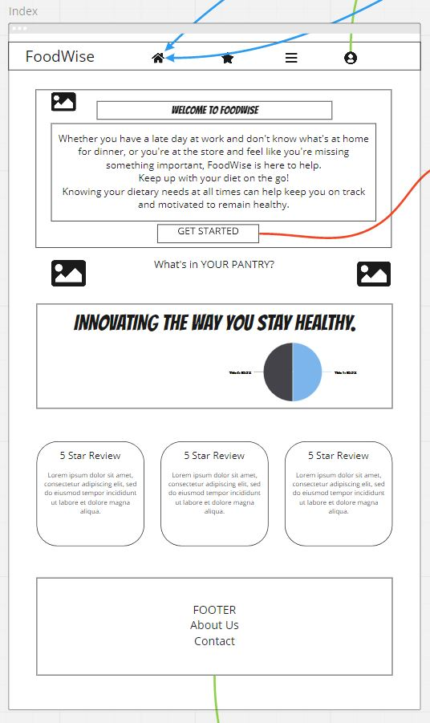
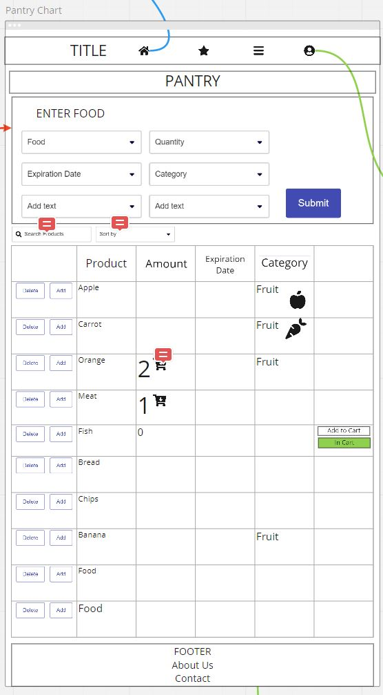
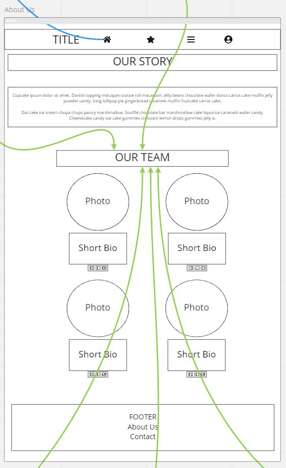
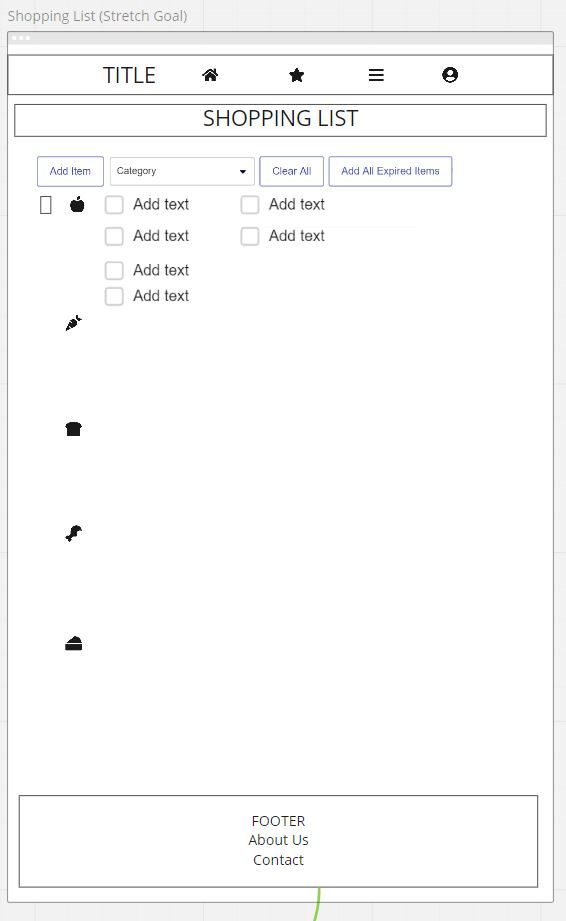
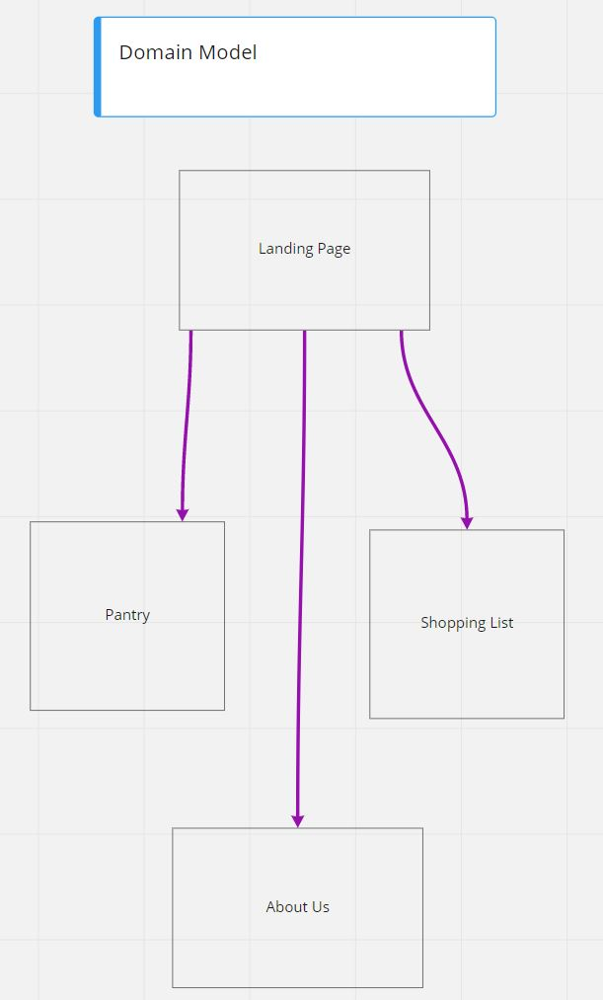
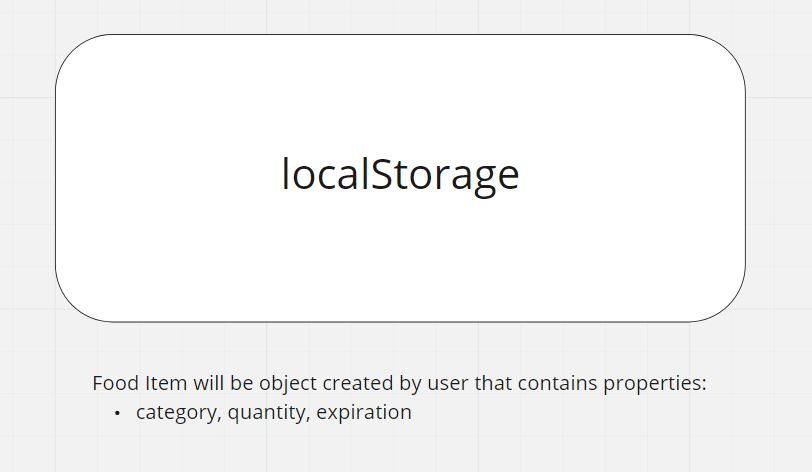

**Members**: Kason Braley, Rahzae Williams, Ryan Emmans, Stefanie Riehle

With this app, a user can monitor their food inventory to reduce food waste as well as track food purchases. 
***
### [**User Stories on GitHub Project Board**](https://github.com/Loki-Code201/PantryPal/projects/1)
***
## **Wireframes**

***
## **Domain Model**

***
## **Local Storage**

***
## **Online Resources Used**
- [Unsplash](https://unsplash.com/) (freely-usable images)
- [Mozilla Developer Network](https://developer.mozilla.org/en-US/)
- [Stack Overflow](https://stackoverflow.com/)
- [W3Schools](https://www.w3schools.com/)

## **Languages Used**
- [HTML5](https://html.spec.whatwg.org/)
- [CSS3](https://www.w3.org/TR/CSS/#css)
- [JavaScript](https://www.ecma-international.org/publications-and-standards/standards/ecma-262/)

## **Online Collaboration Tools Used**
[GitHub](https://github.com/)
[Slack](https://slack.com/)
[Remo](https://remo.co/)

## **Design Tools Used**
[Miro](https://miro.com/)
[Adobe Illustrator](https://www.adobe.com/products/illustrator.html)
***